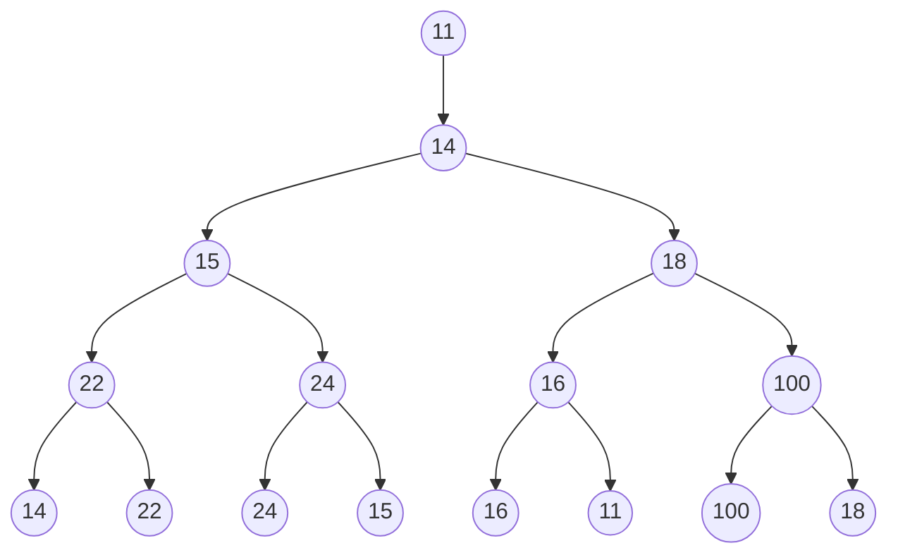
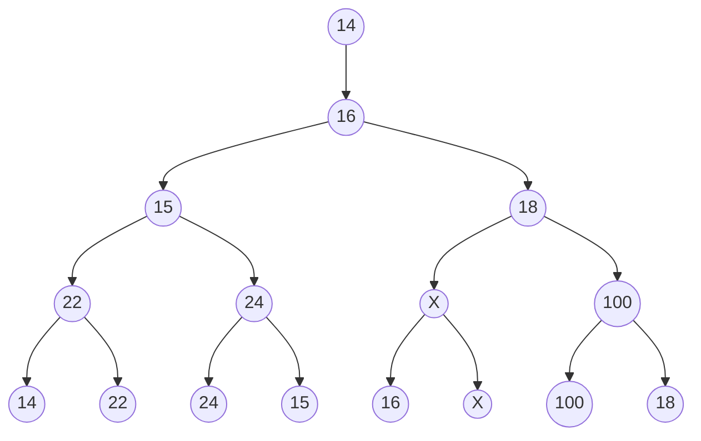

#! https://zhuanlan.zhihu.com/p/583770921
# 数据结构与算法 第九章 外排序书面作业

## 1.

> 假设一个记录长为32个字节，一个块长1024个字节（每个块有32个记录），工作内存是1MB（还有用于I/O缓冲区、程序变量等的其他存储空间）。使用置换选择算法和多路归并，其中归并算法只允许扫描两遍。预计能得到的文件最长为多少？解释这个结果是怎样计算出来的。

一个堆可以利用全部内存来存记录，也就是可以存 $\frac{1\text{MB}}{32\text{Byte}} = \frac{1 \times 1024^2 \text{Byte}}{32\text{Byte}} = 32768$ 个记录，其为生成的顺串的最短长度。

用赢者树/输者树多路归并时，可以存下一半，也就是 $16384$ 条记录。因此，归并两趟，即可合并 $32768 \times 16384^2 = 2^{15} \times (2^{14})^2 = 2^{43}$ 条记录。

因此，预计能得到的文件最长为 $2^{43}\times 32\text{Byte} = 256\text{TB}$。

## 2.

> 设置换选择排序所用的堆空间就是一个缓冲区块的大小，而且对于一个特定的待排文件，一个缓冲区可以容纳8个纪录。

### （1）

> 采用置换选择排序的方法创建关键码由小到大的初始顺串，对有1600个纪录的文件，产生的初始顺串最少为多少个，最多为多少个？平均情况下是多少？请解释是怎样得到这个结果的。

当原文件有序时，产生的初始顺串最少，为 $\boxed{1}$ 个。

当原文件按形如 $91,92,93,94,95,96,97,98;81,82,83,84,85,86,87,88;71,72,\ldots$ 的方式排列时，产生的初始顺串最多，为 $1600/8 = \boxed{200}$ 个。

平均情况下，假设数据随机分布，扫描时新记录的有 $1/2$ 概率比堆顶小，有 $1/2$ 概率比堆顶大，故顺串的平均长度约为 $8\div 1/2 = 16$，初始顺串有 $1/2\times1600/8 = \boxed{100}$ 个。

### （2）

> 写出当对关键码为{61，12，72，18，79，3，48，25，65，22，90，58，14、22、16、100、18、45、11、20，38、30、26、107、50、55、17、27}的置换选择排序后，所产生的初始顺串。

答：3、12、18、22、25、48、58、61、65、72、79、90、100、11、14、16、18、20、22、26、27、30、38、45、50、55、107、17。

| 输出                        | 堆（未排序，｜表示END）             |
| --------------------------- | ----------------------------------- |
|                             | **61，12，72，18，79，3，48，25**   |
| 3                           | 61，12，72，18，79，48，25，**65**  |
| 12                          | 61，72，18，79，48，25，65，**22**  |
| 18                          | 61，72，79，48，25，65，22，**90**  |
| 22                          | 61，72，79，48，25，65，90，**58**  |
| 25                          | 61，72，79，48，65，90，58｜**14**  |
| 48                          | 61，72，79，65，90，58｜14、**22**  |
| 58                          | 61，72，79，65，90｜14、22、**16**  |
| 61                          | 72，79，65，90，**100**｜14、22、16 |
| 65                          | 72，79，90，100｜14、22、16、**18** |
| 72                          | 79，90，100｜14、22、16、18、**45** |
| 79                          | 90，100｜14、22、16、18、45、**11** |
| 90                          | 100｜14、22、16、18、45、11、**20** |
| 100                         | 14、22、16、18、45、11、20、**38**  |
| 11                          | 14、22、16、18、45、20、38、**30**  |
| 14                          | 22、16、18、45、20、38、30、**26**  |
| 16                          | 22、18、45、20、38、30、26、**107** |
| 18                          | 22、45、20、38、30、26、107、**50** |
| 20                          | 22、45、38、30、26、107、50、**55** |
| 22                          | 45、38、30、26、107、50、55｜**17** |
| 26                          | 45、38、30、107、50、55、**27**｜17 |
| 27、30、38、45、50、55、107 | 17                                  |
| 17                          |                                     |

## 3.

> 现有8个顺串，每个顺串的第一个记录的关键码分别为14，22，24，15，16，11，100，18，第二个记录的关键码分别为26，38，30，26，50，28，110，40.请画出对顺串开始8路归并时的败者树，以及输出一个优胜者后重构得到的败者树。

败者树如图：



重构后如图（原来是 $11$ 的地方标为了 $X$）：



## 4.

> 现在有9个长度不同的的顺串，其长度分别为。请用二路归并的方法对其进行归并。

### (1)

> 构造最佳归并树。

排序得到 $6,11,16,17,21,25,40,41,55$ ，按照 Huffman 树的构造方式，得：

```mermaid
graph BT
	6-->6+11=17
	11-->6+11=17
	16-->16+17=33
	17-->16+17=33
	6+11=17-->6+11+21=38
	21-->6+11+21=38
	25-->16+17+25=58
	16+17=33-->16+17+25=58
	6+11+21=38-->6+11+21+40=78
	40-->6+11+21+40=78
	41-->41+55=96
	55-->41+55=96
	16+17+25=58-->6+11+16+17+21+25+40=136
	6+11+21+40=78-->6+11+16+17+21+25+40=136
	41+55=96-->6+11+16+17+21+25+40+41+55=232
	6+11+16+17+21+25+40=136-->6+11+16+17+21+25+40+41+55=232
```

### (2)

> 根据最佳归并树计算每一趟和总的读记录次数。

第一趟：6+11=17

第二趟：16+17+17+21=71

第三趟：25+33+38+40=136

第四趟：41+55+58+78=232

第五趟：96+136=232

总共：688次。

## 5.

> *附加题，相邻匹配策略实现箱子装载的算法（可以不做）。
>
> **在箱子装载问题中，有若干个容量为 c 的箱子和 n 个待装载入箱子中的物品。物品i需占s[i]个单元（0<s[i]≤c）。所谓成功装载（feasible packing），是指能把所有物品都装入箱子而不溢出，而最优装载（optimal packing）则是指使用了最少箱子的成功装载。**
>
> **箱子装载问题是NP复杂问题。因此可用近似的算法求解。在箱子装载问题中，该算法可得到一个接近于最少箱子个数的解。可以采用最先匹配法（First Fit, FF）求近似解：物品按1，2，****⋯****，****n****的顺序装入箱子，假设箱子从左至右排列，每一物品 i 首先放入可盛载它的最左箱子。**
>
> **在相邻匹配（Next Fit）策略中，一次只将一个物品放入一个箱子中。开始时将物品1放入箱子1。对于其余物品，则从最后使用的箱子的下一个箱子开始，用循环的方式轮流查询能够装载该物品的非空箱子。比如，在该轮询法中，若箱子1～箱子b 正在使用，则可认为这些箱子排列成环状。i≠b 时，i 的下一个箱子为i +1；i =b时，i 的下一个箱子为箱子1。若上一个物品放入了箱子j，则从箱子j 的下一个箱子开始不断地查找后续箱子，直到找到具有足够空间的箱子或者又回到箱子j。若没有找到合适的箱子，则启用一新箱子，并将物品放入该箱子中。**
>
> **例，欲将6个物品s[1: 6] = [3, 5, 3, 4, 2, 1 ]放入容量为7的箱子中。用相邻匹配装载法，首先将物品1放入箱子1。物品2无合适的箱子，故插入一个新的箱子——箱子2。对于物品3，从下一箱子开始搜寻非空的合适箱子。上一次使用的箱子为箱子2，故下一个箱子为箱子1。箱子1有足够的空间，所以将物品3放入箱子1。对于物品4，因箱子1是上一次使用的箱子，所以从箱子2开始轮询。箱子2无足够的空间，而箱子2的下一个箱子（箱子1）也无足够的空间，因此启用新箱子——箱子3，并将物品4放入其中。装载物品5的过程是从查寻箱子3的下一个箱子开始的，箱子3的下一个箱子为箱子1，按上述步骤，可查知箱子2是合适的，因此将物品5放入箱子2。对于最后一个物品6，从箱子3开始检查，因该箱有足够空间，可将物品6放入其中。**
>
> **可用最大赢者树来高效地实现相邻匹配策略。与最先匹配法一样，外部节点代表各箱子，比赛是依据各箱子的最大容量来进行的。对于n 个物品的装载问题，从n 个箱子（外部节点）开始工作。观察下图的最大赢者树，其中有6 / 8的箱子已被使用。虽然当n = 8时，图中所示的情况不会出现，但它演示了如何确定装载下一个物品的箱子。若上一个物品被放入箱子l a s t中且当前已使用了b个箱子，则搜索下一个可用的箱子可按如下两个步骤来进行：**
>
> **1)** **找到第一个箱子j，j >last。当箱子总数为n 时，这样的j 总存在。若该箱子非空（即j≤b），则使用之。**
>
> **2)** **若1) 未找到合适的箱子，则在树中搜索适合该物品的最左箱子，这个箱子是目前正在使用的箱子。**
>
> ****
>
> **现在来考察图中的情形。假设下一个物品需7个单元的空间。若last = 3，则在1) 中可确定箱子5有足够的空间。因箱子5是非空箱子，可将物品放入其中。另一方面，若l a s t = 5，则在1) 中获知箱子7有足够空间，因箱子7为空，故移到2 )，找到有足够空间的最左箱子为箱子1，将物品放入其中。**
>
> **为了实现1 )，从箱子j = l a s t + 1开始，其中last 为上一个箱子的编号。注意到若l a s t = n，则所有n个物品都已被装载并且使用了n 个箱子，每个物品分别放在一个箱子中。因此j≤n。**
>
> **请编写采用相邻匹配策略实现箱子装载的算法。**
>
> **注释：一般遍历从箱子j 到根的路径，查询各右子树直到找到第一个含有合适箱子的右子树。当找到该子树时，该子树中具有合适容量的最左箱子就是所查找的箱子。**

不想做，略。